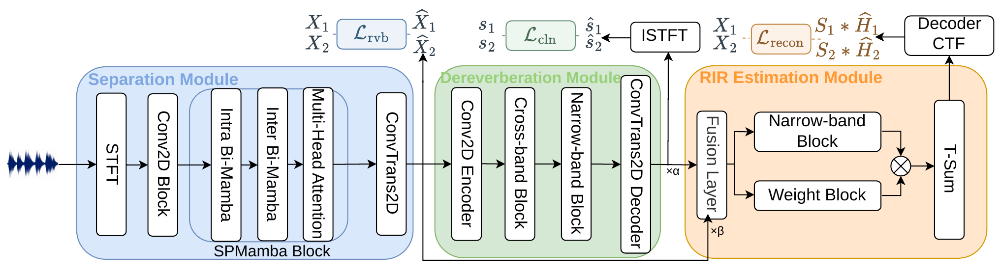

# DAMSEP

## Introduction

Official PyTorch implementation of **DAMSEP: Distance-Aware Monaural Source
Separation using Multi-RIR Estimation**.

**Wen Wen, Qiang Zhou, Yu Xi, Haoyu Li, Bohan Li, and Kai Yu**

[Code](https://github.com/Wenanzhi/DAMSEP) | [Demo](https://wenanzhi.github.io/DAMSEP/)

The [demo source and local preview instructions](docs/README.md) include paired
test-scene geometry, separation audio, and RIR comparisons.

DAMSEP jointly recovers source signals and source-specific acoustic responses
from a single-microphone mixture. It combines source separation, shared
dereverberation, and complex convolutive transfer function (CTF) estimation
through source supervision and reverberant reconstruction. In the paper,
the decoded room impulse responses (RIRs) provide relative near/far ordering
through their direct-to-reverberant ratios (DRRs).

## Network architecture



The three modules are trained jointly to recover source content and acoustic
responses. Reconstruction supervision connects the predicted CTFs to the
reference reverberant sources.

## Quick start

### Installation

Use a CUDA-capable Linux environment. The reference dependencies include
Python 3.9, PyTorch 2.0, and `mamba-ssm==1.2.0.post1`.

```bash
git clone https://github.com/Wenanzhi/DAMSEP.git
cd DAMSEP
conda env create -f environment.yml
conda activate dars
```

### Prepare dataset

Prepare 8 kHz audio and aligned manifests following
[data/README.md](data/README.md). Set `train_dir`, `valid_dir`, and `test_dir`
in [configs/dars.yml](configs/dars.yml); the current loader requires all three
splits. Training audio and manifests must be prepared separately.

HETMIXR contains 20,000 training, 5,000 validation, and 3,000 generated test
mixtures; four-second eligibility filtering leaves 2,801 test mixtures.
The released [distance metadata](data/metadata/distance_test.json) contains
geometry and near/far labels for all 3,000 generated test entries.

### Training

Set `training.gpus` in the configuration to your available GPUs, for example
`[0]` for one GPU. Keep the default per-device batch size of 1 for the current
CTF reconstruction implementation, and set `exp.exp_name` for the run.

```bash
# Train from scratch
python audio_train.py --conf_dir configs/dars.yml

# Resume a training run
python audio_train.py --conf_dir configs/dars.yml \
  --resume_from_checkpoint Experiments/checkpoint/dars_mixed_p5/last.ckpt
```

Checkpoints and the resolved configuration are saved to
`Experiments/checkpoint/<exp_name>/`. TensorBoard logs are saved to
`Experiments/tensorboard_logs/`.

### RIR analysis

The retained utilities operate on already decoded, two-channel RIR WAV files:

```bash
python look2hear/eval/estimate_DRR.py -i path/to/rir_wavs --sr 8000
python look2hear/eval/estimate_T60_stereo.py -i path/to/rir_wavs --sr 8000
```

They save acoustic-parameter estimates and channel-comparison summaries as
JSON files beside the inputs. The model's `rir` output is a complex CTF; the
sine-sweep and inverse-filtering pipeline used to decode it in the paper is
not included in this release.

<details>
<summary>Implementation notes and model outputs</summary>

- **Training objectives:** The default recipe uses four-second segments at
  8 kHz and Adam with an initial learning rate of `1e-3`. Clean-source
  negative-SNR supervision has unit weight; reverberant-source and CTF
  reconstruction losses use `w_rev=0.1` and `w_recon=0.5`. Reconstruction
  filters reference clean-source spectra through the estimated CTFs.
  Direct RIR supervision is disabled (`w_rir=0`).
- **Source assignment:** The default configuration uses
  fixed distance order (`pit_from: no_pit`), with source 1 nearer and source 2
  farther. Section 2.3 of the manuscript describes permutation-invariant
  matching; this differs from the released source-assignment setting.
- **Training settings:** The default scheduler and early-stopping patience
  are 5.
- **Naming:** The model class `SPMamba`, environment name `dars`, and existing
  configuration paths follow the current implementation.

For input waveforms of shape `[B, T]`, the default model returns:

| Key | Shape | Output |
| --- | --- | --- |
| `x_sep` | `[B, 2, T]` | Separated reverberant sources |
| `x_derev` | `[B, 2, T]` | Clean-source estimates |
| `rir` | `[B*2, 2, 257, 60]` | Real and imaginary components of source-specific CTFs |

</details>

## Citation

Please cite DAMSEP if you use this work:

```bibtex
@misc{wen2026damsep,
  title  = {DAMSEP: Distance-Aware Monaural Source Separation using Multi-RIR Estimation},
  author = {Wen, Wen and Zhou, Qiang and Xi, Yu and Li, Haoyu and Li, Bohan and Yu, Kai},
  year   = {2026}
}
```

The public preprint link and identifier will be added when available.

## Acknowledgements

The separation backbone and training framework build on
[SPMamba](https://github.com/JusperLee/SPMamba). The response-estimation design
and reconstruction objective build on
[Rec-RIR](https://github.com/Audio-WestlakeU/Rec-RIR).

This repository uses the [Apache License 2.0](LICENSE).
Rec-RIR-derived components retain their [MIT license](licenses/Rec-RIR-LICENSE).
